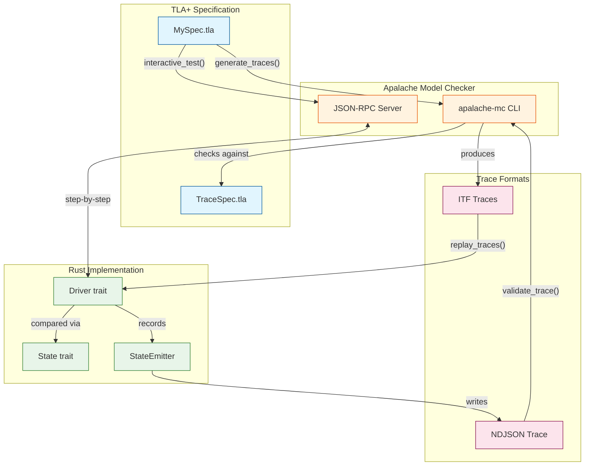

# tla-connect

TLA+/Apalache integration for model-based testing in Rust.

## Overview

`tla-connect` provides tools for integrating [TLA+](https://lamport.azurewebsites.net/tla/tla.html) and [Apalache](https://apalache.informal.systems/) model checking into Rust test suites. It enables:

- **Trace validation**: Verify that your implementation matches TLA+ specifications
- **Model-based testing**: Generate test cases from TLA+ models
- **Counterexample replay**: Automatically reproduce bugs found by model checkers

## Architecture



| Approach | Direction | Catches |
|----------|-----------|---------|
| 1. Batch Replay | Spec → Implementation | Implementation doesn't handle a case the spec allows |
| 2. Interactive RPC | Spec ↔ Implementation | Implementation doesn't handle a case the spec allows |
| 3. Post-hoc Validation | Implementation → Spec | Implementation does something the spec doesn't allow |

## Features

- ITF (Informal Trace Format) parsing and validation
- Apalache CLI integration for trace generation
- Apalache JSON-RPC client for interactive symbolic testing
- Trace generation from TLA+ specifications
- State comparison and diff output for debugging mismatches
- Support for both file-based and RPC-based workflows

## Feature Flags

- `replay` (default): ITF trace replay against a Driver
- `trace-gen` (default): Apalache CLI trace generation
- `trace-validation` (default): Post-hoc NDJSON trace validation
- `rpc`: Interactive symbolic testing via Apalache JSON-RPC
- `parallel`: Parallel trace replay using rayon
- `full`: Enable all features

## Installation

Add this to your `Cargo.toml`:

```toml
[dependencies]
tla-connect = "0.0.2"

# For interactive RPC testing:
# tla-connect = { version = "0.0.2", features = ["rpc"] }
```

## Quick Start

### Approach 1: Batch Trace Replay

Generate traces with Apalache, then replay against your implementation:

```rust
use tla_connect::*;
use serde::Deserialize;

#[derive(Debug, PartialEq, Deserialize)]
struct MyState {
    counter: i64,
}

impl State<MyDriver> for MyState {
    fn from_driver(driver: &MyDriver) -> Result<Self, DriverError> {
        Ok(MyState { counter: driver.counter })
    }
}

struct MyDriver {
    counter: i64,
}

impl Driver for MyDriver {
    type State = MyState;

    fn step(&mut self, step: &Step) -> Result<(), DriverError> {
        switch!(step {
            "init" => { self.counter = 0; },
            "increment" => { self.counter += 1; },
            "decrement" => { self.counter -= 1; },
        })
    }
}

fn main() -> Result<(), Error> {
    let config = ApalacheConfig::builder()
        .spec("specs/Counter.tla")
        .inv("TraceComplete")
        .build();

    let generated = generate_traces(&config)?;
    replay_traces(|| MyDriver { counter: 0 }, &generated.traces)?;
    Ok(())
}
```

### Approach 2: Interactive Symbolic Testing (requires `rpc` feature)

Step-by-step symbolic execution via Apalache's explorer server:

```rust
use tla_connect::*;

#[tokio::main]
async fn main() -> Result<(), Error> {
    let client = ApalacheRpcClient::new("http://localhost:8822").await?;

    let config = InteractiveConfig::builder()
        .spec("specs/Counter.tla")
        .num_runs(100)
        .max_steps(50)
        .seed(42) // Reproducible runs
        .build();

    interactive_test(|| MyDriver::default(), &client, &config).await?;

    Ok(())
}
```

### Approach 3: Post-hoc Trace Validation

Record your implementation's execution, then validate against the spec:

```rust
use tla_connect::*;
use serde::Serialize;
use std::path::Path;

#[derive(Serialize)]
struct RecordedState {
    counter: i64,
}

fn main() -> Result<(), Error> {
    // Record execution trace
    let mut emitter = StateEmitter::new(Path::new("trace.ndjson"))?;
    emitter.emit("init", &RecordedState { counter: 0 })?;
    emitter.emit("increment", &RecordedState { counter: 1 })?;
    emitter.emit("increment", &RecordedState { counter: 2 })?;
    emitter.finish()?;

    // Validate against TLA+ spec
    let config = TraceValidatorConfig::builder()
        .trace_spec("specs/CounterTrace.tla")
        .build();

    let result = validate_trace(&config, Path::new("trace.ndjson"))?;

    match result {
        TraceResult::Valid => println!("Trace is valid!"),
        TraceResult::Invalid { reason } => println!("Invalid: {reason}"),
    }

    Ok(())
}
```

## Requirements

- Rust 1.93 or later
- Apalache (if using trace generation or validation features)

## Documentation

For detailed documentation, see [docs.rs/tla-connect](https://docs.rs/tla-connect).

## License

Licensed under either of:

- Apache License, Version 2.0 ([LICENSE-APACHE](LICENSE-APACHE) or http://www.apache.org/licenses/LICENSE-2.0)
- MIT license ([LICENSE-MIT](LICENSE-MIT) or http://opensource.org/licenses/MIT)

at your option.

## Contribution

Unless you explicitly state otherwise, any contribution intentionally submitted for inclusion in the work by you, as defined in the Apache-2.0 license, shall be dual licensed as above, without any additional terms or conditions.
